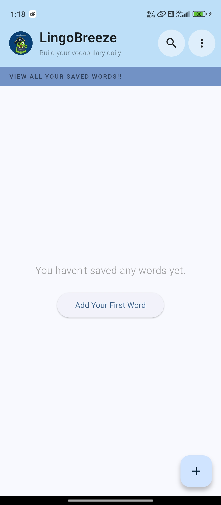
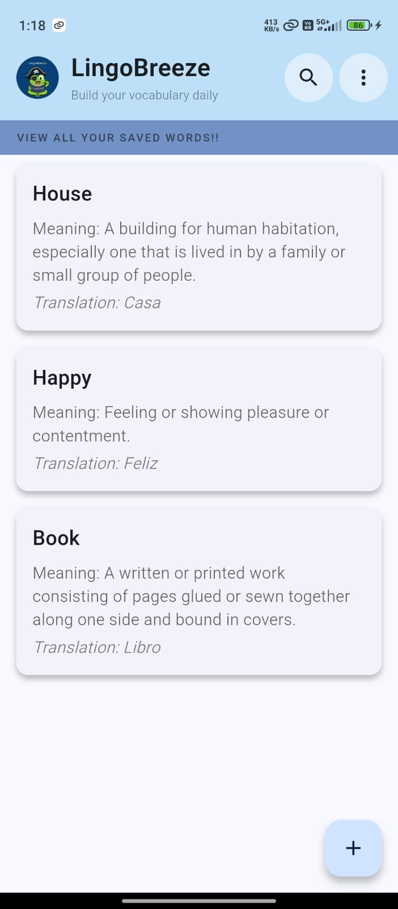
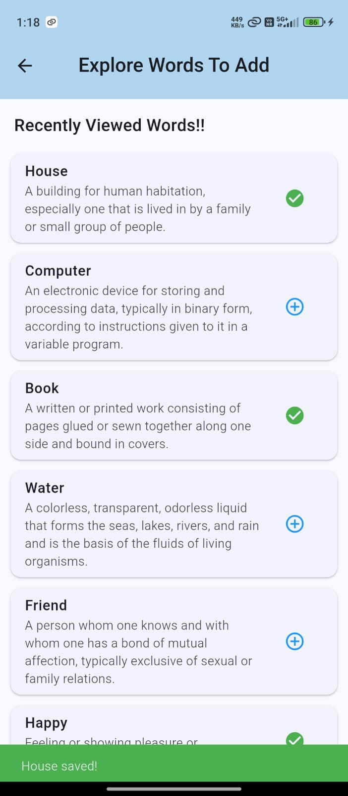
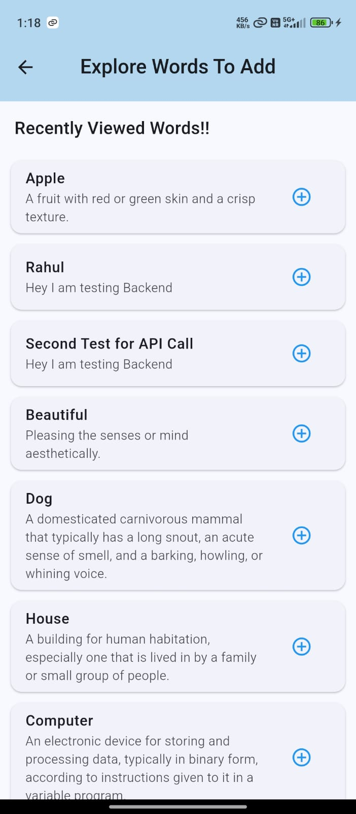
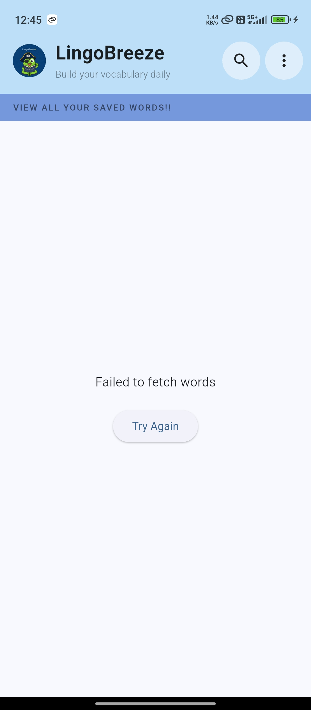
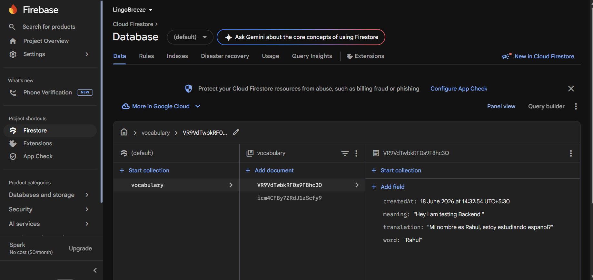
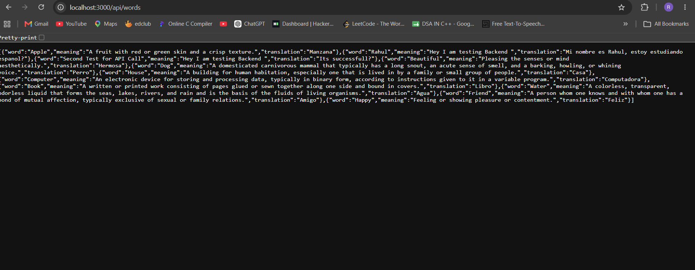

# LingoBreeze Vocabulary Screen

<p align="center">
  <b>A Flutter-based Application built as part of a Flutter Development Internship Assessment.</b>
</p>

## Overview

LingoBreeze Dictionary is a vocabulary learning application that fetches word data from a Node.js REST API and allows users to save words permanently using Firebase Firestore.

###  Key Features

1. Fetch vocabulary words from a Node.js API
2. Save favorite words to Firebase Firestore
3. View saved vocabulary anytime
4. Riverpod state management

## Tech Stack

| Layer            | Technology           |
| ---------------- | -------------------- |
| Frontend         | Flutter              |
| State Management | Riverpod             |
| Backend          | Node.js + Express.js |
| Database         | Firebase Firestore   |

#  Application Screenshots

<p align="center">

<b>Home Screen</b><br> 

<br><br>

<b>Saved Vocabulary Screen</b><br> 

<br><br>

<b>Add Word Screen</b><br> 

<br><br>

<b>Loading State</b><br> 

<br><br>

<b>Error State</b><br> 

<br><br>

<b>Firebase Integration</b><br> 

<br><br>

<b>Backend Running Locally</b><br> 

</p>

## 📂 Project Structure

```text
lib/
├── core/
├── features/
│   └── vocabulary/
│       ├── data/
│       ├── domain/
│       └── presentation/
└── shared/

backend/
├── src/
│   ├── routes/
│   ├── controllers/
│   └── data/
```

---

# Firebase Setup

### 1. Create Firebase Project

Create a new Firebase project from the Firebase Console.

### 2. Register Android App

Add your Android application to Firebase.

### 3. Download Configuration File

Download:

```text
google-services.json
```

Place it inside:

```text
flutter-app/android/app/google-services.json
```

### 4. Create Firestore Database

Create a Firestore Database and start it in:

```text
Test Mode
```

for development purposes.

---

# Running the Project

## Step 1: Clone Repository

```bash
git clone <your-repository-url>
cd LingoBreeze
```

## Step 2: Start Backend Server

Navigate to backend folder:

```bash
cd backend
```

Install dependencies:

```bash
npm install
```

Run server:

```bash
npm start
```

API Endpoint:

```text
http://localhost:3000/api/words
```

Verify by opening the URL in your browser.


## Step 3: Configure API URL

Update your Flutter configuration:

```dart
class AppConfig {
  static const String baseUrl = 'http://YOUR_LOCAL_IP:3000/api';
}
```

Example:

```dart
class AppConfig {
  static const String baseUrl = 'http://192.168.1.5:3000/api';
}
```

## Step 4: Run Flutter App

Navigate to Flutter application:

```bash
cd flutter-app
```

Install packages:

```bash
flutter pub get
```

Run app:

```bash
flutter run
```

---

# My Tips

### Wireless Connection

* Connect PC and Android device to the same Wi-Fi.
* Use Android Studio's Wireless Debugging (QR Code).

### USB Connection

* Enable Developer Options.
* Enable USB Debugging.
* Connect phone via USB cable.
* Verify device connection before running:

```bash
flutter devices
```

<p align="center">
   If you liked this project, consider giving it a star.
</p>

<p align="center">
  <b>Thank You for Reading ❤️</b>
</p>
